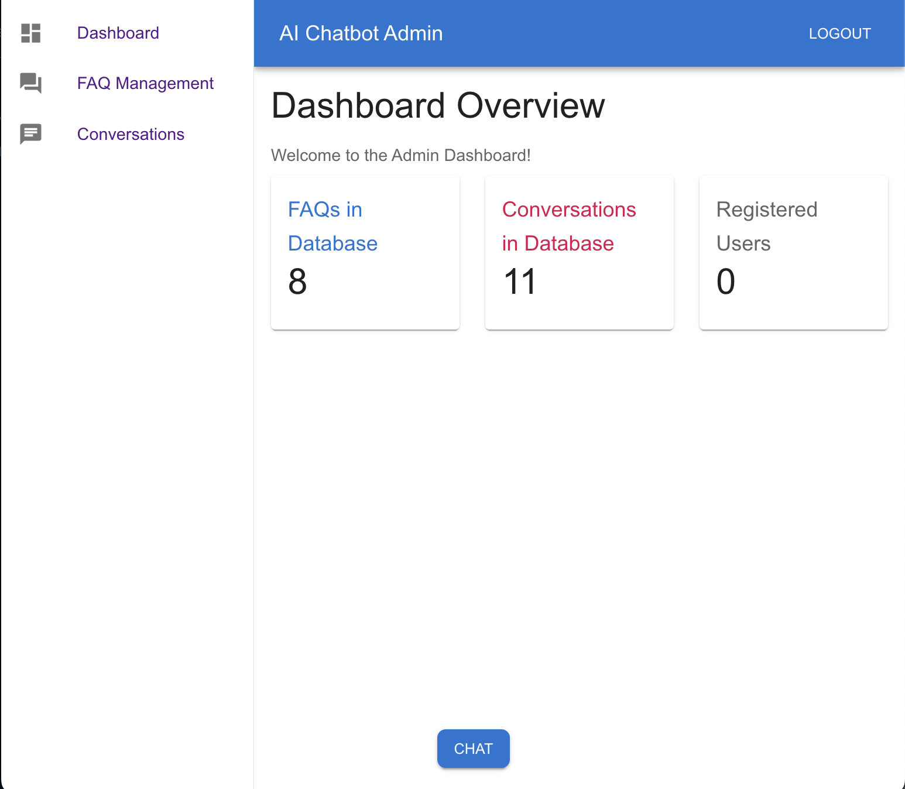
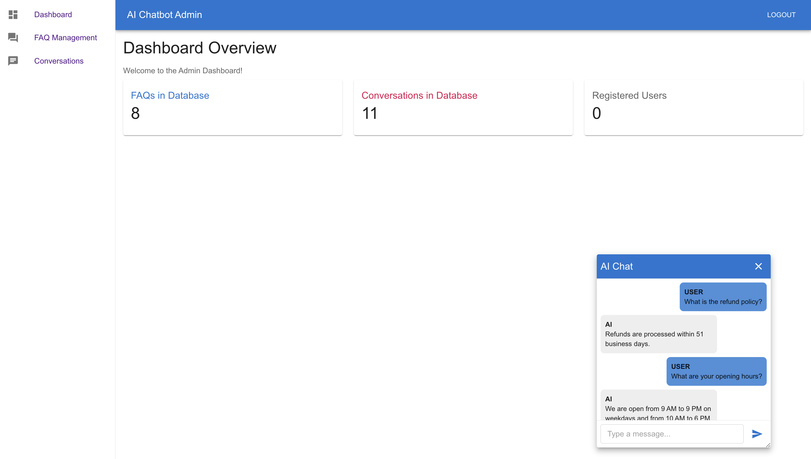
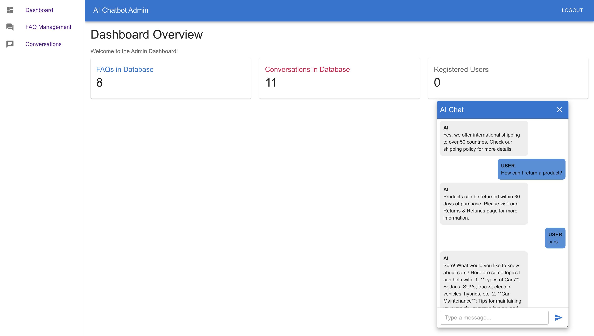
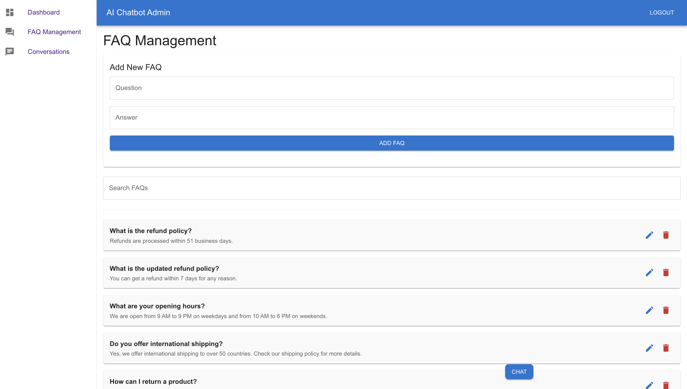
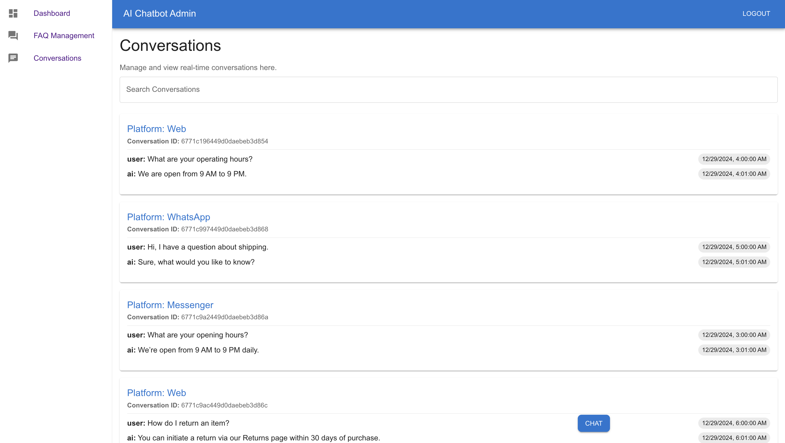

# **AI Chatbot for Customer Support**

An intelligent and scalable chatbot application designed to enhance customer service experiences. The solution integrates **AI-powered responses** with **real-time messaging platforms** like WhatsApp, Facebook Messenger, and a web-based chat widget. Built with a **React** frontend, **Node.js/Express** backend, and **MongoDB** for robust data handling.

---

## **Overview**

The **AI Chatbot for Customer Support** automates customer interactions, manages FAQs dynamically, and provides a user-friendly dashboard for monitoring conversations. Designed for flexibility, it supports multi-channel communication to help businesses engage effectively with their audience.

**Screenshots**  
Below are previews showcasing the chatbot's interface and features:


#### **Admin Dashboard**  
## Manage conversations, FAQs, and analytics in one place.



#### **Chat Widget**  
## Interact with customers through an intelligent, responsive interface.

1. **FAQ-based Response:**
   - **Description:** If the query matches an entry in the FAQ database, the chatbot responds with the pre-defined answer, ensuring quick and consistent replies.
   - 

2. **AI Model Response:**
   - **Description:** For queries not found in the FAQ database, the chatbot utilizes the latest GPT model to generate a response. This allows the chatbot to handle a wide range of questions, providing flexibility and learning capability over time.
   - 


#### **Add FAQ**

- **Description:** Easily add or modify frequently asked questions via the admin panel. This feature allows administrators to directly input and manage the data—questions and answers—that the chatbot uses to respond to user inquiries. By maintaining an up-to-date FAQ database, the chatbot can provide accurate and consistent answers, enhancing the user experience.




#### **Conversations**

- **Description:** This section of the admin panel allows you to view and manage all user interactions with the chatbot. 
- Each conversation is logged and displayed in real-time, enabling administrators to monitor chatbot performance and user engagement. 
- The interface provides detailed information on each conversation, including the platform used *(e.g., Web, WhatsApp, Messenger),* the full chat history, and timestamps, helping to ensure that user queries are being addressed effectively and efficiently.




---

## **Key Features**

- **AI-Powered Responses:** Automatically handles queries using GPT-4 or Dialogflow.
- **Platform Integration:** Supports WhatsApp, Facebook Messenger, and web-based chat widgets.
- **Dynamic FAQ Management:** Easily add, update, or remove FAQs through the admin panel.
- **Real-Time Conversations:** View, filter, and manage customer interactions instantly.
- **Responsive Design:** Modern, accessible, and customizable UI for seamless user experiences.

---

## **Technology Stack**

- **Frontend:** React, Material-UI  
- **Backend:** Node.js, Express  
- **Database:** MongoDB (Atlas or local instance)  
- **Real-Time Communication:** Socket.IO  
- **AI Integration:** OpenAI GPT-4 / Google Dialogflow  

---

## **Getting Started**

### **Prerequisites**

1. **Node.js & npm:** Ensure these are installed.
2. **MongoDB:** Set up a MongoDB Atlas account or a local MongoDB instance.
3. **API Keys:** Obtain API keys for OpenAI or Dialogflow, and optionally configure accounts for WhatsApp (Twilio) and Facebook Messenger.

---

### **Backend Setup**

1. **Clone the Repository:**
   ```bash
   git clone https://github.com/devtalent2030/ai-chatbot-customer-support.git

## API Endpoints

| Endpoint                                | Method | Description                              |
|-----------------------------------------|--------|------------------------------------------|
| `/api/auth/login`                       | POST   | Authenticate user credentials            |
| `/api/faq`                              | GET    | Fetch all FAQs                           |
| `/api/faq/:id`                          | GET    | Fetch a specific FAQ by ID               |
| `/api/faq`                              | POST   | Create a new FAQ                         |
| `/api/faq/:id`                          | PUT    | Update an existing FAQ                   |
| `/api/faq/:id`                          | DELETE | Delete an FAQ                            |
| `/api/conversations`                    | GET    | Fetch all conversations                  |
| `/api/conversations/:id`                | GET    | Fetch a specific conversation by ID      |
| `/api/conversations`                    | POST   | Create a new conversation                |
| `/api/conversations/:id`                | DELETE | Delete a conversation                    |
| `/api/conversations/whatsapp/webhook`   | POST   | Handle incoming WhatsApp messages        |
| `/api/conversations/messenger/webhook`  | POST   | Handle incoming Messenger messages       |

# Future Enhancements

- **Multilingual Support:** Enable conversations in multiple languages.
- **Advanced Analytics Dashboard:** Provide deeper insights into chatbot performance.
- **Voice-Enabled Chat:** Integrate voice interactions for WhatsApp and Messenger.
- **Payment Integration:** Allow transactions directly via the chatbot.
- **Enhanced Security Features:** Implement advanced authentication and authorization mechanisms.

## License

This project is licensed under the MIT License. See the LICENSE file for more details.

## Contributing

We welcome contributions to this project. To contribute:

1. Fork the repository.
2. Create a branch: `feature/your-feature-name`.
3. Submit a pull request with a clear description of your changes.
4. Feel free to reach out for questions or suggestions!